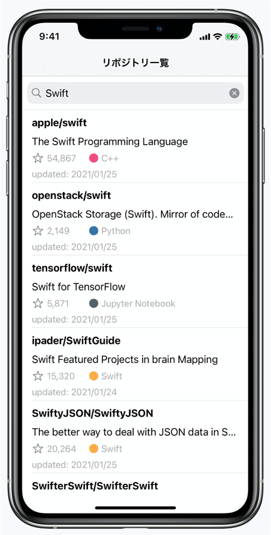
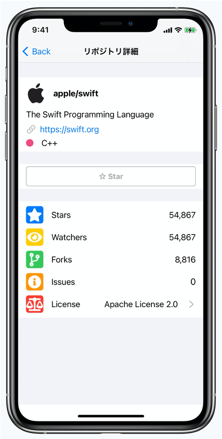
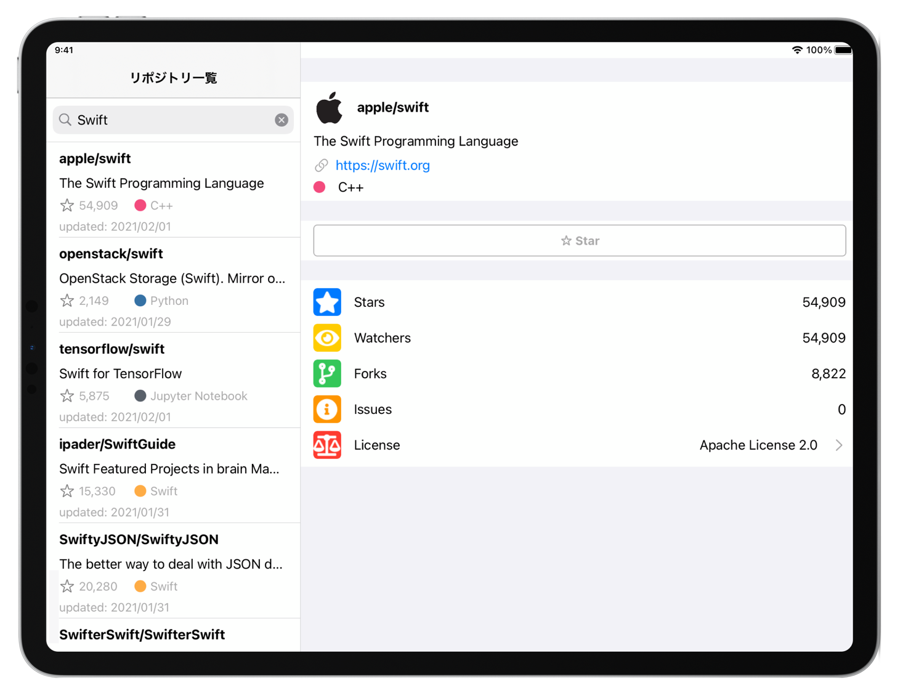

# YUMEMI.inc, Coding test for iOS engineer

### System requirements

- Xcode version 15.0 (15A240d)
- pod version 1.13.0
- target iOS 13.0

### Get started

#### Git

1. Install `git flow`  command

```bash
$ brew install git-flow
```

#### Grove the code
1. Clone this code in your PC
2. Change a branch to `develop`
3. Install packages

```ruby
$ pod install
```

4. Open project with Xcode

```bash
$ open iOSEngineerCodeCheck.xcworkspace
```

### Design

- Create one ViewController and one Stroyboard for one screen
- Use Redux
  - class relationship
    
  - file name
    - screen name + class name.swift

### UI

|Initial|Searching|Detail|
| :----------------------------------------: | :----------------------------------------: | :----------------------------------------: |
||||

|                  iPad                  |
| :------------------------------------: |
|  |

### Reference

- [GitHub API document](https://docs.github.com/ja/rest/reference/search#search-repositories)

### Note

#### Find Xcode env variables

```bash
$ xcodebuild -showBuildSettings | grep "PROJECT"
```

#### GraphQL GitHub

1. Install Apollo sdk

```bash
$ npm install -g apollo
```

* node 14.3.0

2. Get GitHub access token

save in ``./github-access-token.json`（setting .gitignore）

3. Get GitHub API Schema

```bash
$ apollo schema:download --endpoint="https://api.github.com/graphql" --header "Authorization: Bearer {ACCESS_TOKEN}"
```

4. Create query.graphql
5. Install Apollo, CLI as SwiftPackageManager [doc](https://www.apollographql.com/docs/ios/get-started#4-setup-and-run-code-generation)
6. Create config file

```bash
$ ./apollo-ios-cli init --schema-name GitHubGraphQL --module-type swiftPackageManager
```

7. Generate Package

```bash
$ ./apollo-ios-cli generate
```
8. Add Package(GitHubGraphQL) in Xcode project

- Using SwiftPackageManager
- Select Xcode > File > Add Package Dependencies... > Add Local...
- Select GitHubGraphQL in root and select the target


<br />

❗️ GraphQL Package is belong to gitignore like Pods because of large data
